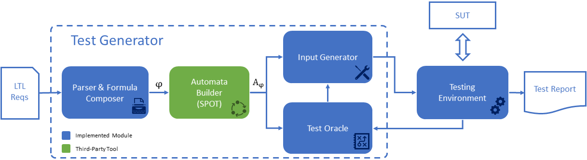

# Tutorial

This tutorial shows how to use some of the APIs provided by SpecPro.

## Read Input Requirements

In order to read input requirements, and build a `LTLSpec` object, we have to instantiate an object 
implementing the abstract class `AbstractLTLFrontEnd`.
SpecPro provides two default implementations `PSPFrontEnd` and `LTLFrontEnd` to read Property Specification Patterns (PSPs)
and Linear Temporal Logic (LTL) formulae, respectively.

    AbstractLTLFrontEnd fe = new PSPFrontEnd();
    LTLSpec spec = fe.parseFile("file.req");
    
`AbstractLTLFrontEnd` also provides other ausiliary methods such as `parseString` and `parseStream` to parse a specification
stored in a `String` or generic `InputStream`.

## Translate
SpecPro can translate a `LTLSpec` into a variety of formats for off-the-shelf model checkers and LTL satisfiability solvers.

For example, to translate a `LTLSpec` into a NuSMV specification we just need to instantiate a `NuSMVTranslator`:

    LTLSpec spec = ...
    PrintStream outStream = new PrintStream("output.smv");
    NuSMVTranslator translator = new NuSMVTranslator();
    translator.translate(outStream, spec);
    
Other available translators are  `AALTATranslator`, `SpotTranslator`, `PandaTranslator`, `PltlMupTranslator` and `TRPUCTranslator`.  

The user can add a new translator simply extending the `LTLToolTranslator` abstract class and implementing the `translate` method.

## Check Consistency
SpecPro provides a `ConsistencyChecker` class that automatically perform the consistency check of a `LTLSpec` given a `ModelChecker` instance.
`ModelChecker` is an abstract class and its implementations are responsible to interact with the actual model checker tools.
SpecPro implements two auxiliary classes: `Aalta` and `NuSMV`. In order
 to use them, you have to set `SPECPRO_AALTA` and `SPECPRO_NUSMV` environment variables, respectively.

    LTLSpec = ...
    ModelChecker mc = new Aalta();
    ConsistencyChecker consistencyChecker = new ConsistencyChecker(mc, spec, "out.temp");
    ConsistencyChecker.Result result = consistencyChecker.run();
    if(result == Consistency.Result.CONSISTENT) {
        System.out.println("SAT");
    } else {
        System.out.println("UNSAT");
    }

The third parameter of `ConsistencyChecker` is the path for a temporary file that is created during
the execution.

## Muc Extraction
Similarly, if a specification is inconsistent, SpecPro provides the abstract class `InconsistencyFinder` that aims at 
findinding a minimal subsets of requirements that explain the inconsistency, often called Minimal Unsatisfiable Core (MUC).
SpecPro provides two implementations of this class: `LinearInconsistencyFinder` and `BinaryInconsistencyFinder`.

    LTLSpec = ...
    ModelChecker mc = new Aalta();
    ConsistencyChecker consistencyChecker = new ConsistencyChecker(mc, spec, "out.temp");
    InconsistencyFinder muc = new BinaryInconsistencyFinder(consistencyChecker);
    List<InputRequirement> reqs = muc.run();
    if(reqs == null) {
        System.out.println("Fail occured during model checking call.");
        System.out.println(mc.getMessage());
    } else {
        System.out.println("# MUC of " + reqs.size() + " elements found: ");
        for (InputRequirement r : reqs) {
            outStream.println(r.getText());
        }
    }

## Testing

In order to test black-box systems, SpecPro implements the framework presented below.
The System Under Test (SUT) is the system we want to test, and SpecPro interact with it during execution, probing some 
inputs and evaluating the produced output.

The tests are generated starting from a `LTLSpec` that is assumed to be consistent.
In addition to the list of requirements, the specification has to indicate the list
of input and output atomic variables.

To generate test cases for a model or a system, we have to implement the following steps:

1. Build the `LTLSpec` and an automaton representation of it, using the `LTL2BA` class.
This operation requires `Spot` to be installed on the machine in which the code is running.

       LTL2BA ltl2ba = new LTL2BA();
       ltl2ba.setType(LTL2BA.AutomatonType.NBA);
       ltl2ba.setOptimizationLevel(LTL2BA.OptimizationLevel.LOW);
       BuchiAutomaton automaton = ltl2ba.translate(spec);
       automaton.expandEdges();
       
2. Instantiate a testing generation algorithm class. SpecPro implements different algorithms 
    (implementing the `TestGenerator` abstract class)    

       GDFSTestGenerator testGenerator = new GDFSTestGenerator(automaton, spec.getInputVariables());
       testGenerator.setMinLength(2);
       
3. Create an instance of `SUT`, i.e., an interface for the System Under Test. SpecPro provides a default implementation
   of `SUT`, namely `MealyMachineSUT`, to test models in the KISS format, but the user is higly encouraged to implement his
   own SUT class (See below).
   
       MealyMachine mealy = MealyMachineBuilder.parseKISSFile(modelFile);
       SUT sut = new MealyMachineSUT(mealy);

4. Istantiate a `TestingEnvironment` and start the testing generation.

       TestingEnvironment environment = new TestingEnvironment(testGenerator, sut);
       environment.setMaxTraceLength(10);
       
       Map<Trace, TestOracle.Value> result = environment.runTests();

## Testing Framework

The main components of the framework are:

- **Parser** reads the input specification, creates the intermediate data structures
and builds the conjunction of requirements.
- **Automata Builder** builds a Büchi or equivalent automaton representation of
the input specification.
- **Input Generator** chooses which inputs to execute on the SUT.
- **Test Oracle** evaluates the output produced by the SUT and checks if it satisfies the specifications.
- **Testing Environment** is responsible for orchestrating the interaction between the
different components. It queries Input Generator for new tests and executes them
on the SUT. It collects the output and passes it to Oracle for evaluation. If the
test is complete, it stores the final verdict and resets the environment to start a
new test.

## System Under Test

You can easily define your own **System Under Test** by creating a new class extenging the `SUT` abstract class

    import it.sagelab.specpro.models.ltl.Atom;
    import it.sagelab.specpro.models.ltl.assign.Assignment;
    import it.sagelab.specpro.testing.SUT;
    
    public class CustomSUT extends SUT {
    
and implements its abstract methods:
 
 - **Reset:** called whenever the SUT should be resetted to its initial state
 
     
    @Override
    public void reset() {
    }
    
 - **Exec:** it takes the input assignment to execute on the SUT and returns a new assignment with the output
 of the system
 
 
     @Override
     public Assignment exec(Assignment input) {
         boolean inputVar = input.getAssignments().get("inputVar");
         ...
         Assignment output = new Assignment();
         output.add(new Atom("outputVar"), false);
         return output;
     }

